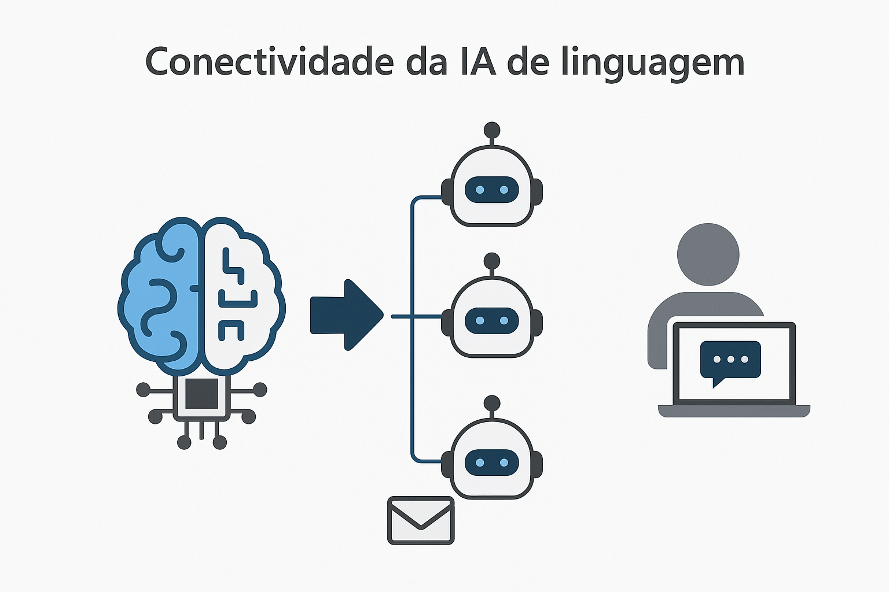

# Projeto: Análise de Sentimentos e Linguagem com Azure AI (Simulado)

Este repositório documenta um projeto prático **baseado no laboratório da DIO** sobre o uso do **Azure Speech Studio e Language Studio**, ferramentas da Microsoft voltadas para **inteligência artificial aplicada à fala e linguagem natural**.

> **Nota:** Este projeto é **uma simulação educacional**, pois não foi possível acessar diretamente o Azure devido a limitações com conta gratuita.

---

## Objetivos

- Compreender o funcionamento das ferramentas Azure Speech Studio e Language Studio.
- Documentar conceitos como análise de sentimentos, reconhecimento de entidades, compreensão da linguagem natural e síntese de voz.
- Demonstrar como essas tecnologias podem ser aplicadas em contextos reais (chatbots, call centers, turismo, acessibilidade).

---

## Conceitos e Recursos Abordados

### 1. **Compreensão da Linguagem Natural (NLU)**
- **Enunciado**: Texto ou fala do usuário.
- **Entidade**: Elementos extraídos como nomes de lugares, pessoas, marcas.
- **Intenção**: Objetivo do usuário ao falar (ex: pedir informação, fazer reclamação).

### 2. **Análise de Texto com Language Studio**
Exemplo analisado:
> **Texto**: "Passei férias maravilhosa na França."  
> - Idioma detectado: **Português**  
> - Sentimento: **Positivo (0.88)**  
> - Frase-chave: `"férias maravilhosa"`  
> - Entidade: `"França"` (Localização)  

Essas análises ajudam empresas a coletar insights de feedbacks, redes sociais, atendimentos etc.

### 3. **Reconhecimento e Síntese de Fala com Speech Studio**
- **Reconhecimento de fala**: Converte voz em texto.
- **Síntese de fala (Text-to-Speech)**: Converte texto em áudio, útil por exemplo para **motoristas de aplicativo**.
- Suporte a múltiplos idiomas e vozes personalizadas.

---

## Aplicações Práticas

- **Call centers automatizados** com bots que usam scripts para reclamações.
- **Chatbots multicanais** (email, chat, mensagem) conectados à IA.
- **Turismo e atendimento ao cliente** com análise de sentimentos e entidades.
- **Acessibilidade**, com leitura de textos para pessoas com deficiência visual.

---

## Representação Visual (Simulada)

Essa imagem mostra a integração da IA  com múltiplos canais (compreensão de linguagem).
> 🧠 simboliza a IA processando linguagem natural e se conectando com:
- **E-mail**
- **Chatboots**
- **Conversas automatizadas**
- **Leitura em voz alta - Acessibilidade**

---

## Aprendizados

Durante este projeto simulado, mesmo sem acesso direto à plataforma do Azure, consegui entender na prática os principais conceitos e aplicações das ferramentas de IA de linguagem da Microsoft:

- **Interpretação de Sentimentos e Entidades**: Aprendi como a IA consegue identificar emoções (positivas, negativas ou neutras) em textos e reconhecer entidades como nomes de lugares, pessoas ou objetos relevantes. Isso me fez refletir sobre como essas análises automatizadas podem ajudar empresas a entender melhor seus clientes.

- **Compreensão da Linguagem Natural (NLU)**: Assimilei como a IA diferencia **intenção**, **entidades** e **contexto** em frases aparentemente simples, o que é essencial para o funcionamento de bots de atendimento eficientes.

- **Conversão de Texto em Fala**: Vi como o Speech Studio pode ser uma ferramenta poderosa para acessibilidade, permitindo que sistemas “leiam” conteúdos em voz alta com fluência e naturalidade.

- **Aplicações Reais**: Enxerguei o potencial dessas tecnologias em áreas como **atendimento ao cliente**, **turismo**, **educação** e **inclusão digital**, principalmente por meio da automação de tarefas repetitivas e melhoria na experiência do usuário.

- **Benefícios Estratégicos**:
  - Automatização de processos com ganho de escala.
  - Redução de custos operacionais.
  - Atendimento 24h com consistência na linguagem.
  - Coleta de dados úteis para tomadas de decisão.

Esse projeto me ajudou a consolidar conceitos teóricos de forma prática, reforçando o quanto a inteligência artificial já está presente em várias soluções do dia a dia.

## Links úteis

- [Passo a passo Speech Studio](http://aka.ms/ai900-speech)  
- [Passo a passo Text Analysis](http://aka.ms/ai900-text-analysis)

---

## Documentações Oficiais 

- Explore Speech Studio - Laboratório no Microsoft Learning
- Analyze text with Language Studio ** - Laboratório no Microsoft Learning

---

## Links úteisMateriais Complementares sobre GitHub 

- GitHub Quick Start ** - Repositório com Link para Aulas de Git e GitHub 
- GitBook: Formação GitHub Certification - Material textual sobre GitHub
- Documentação do GitHub - Guia completo para uso do GitHub 
- GitHub Markdown - Guia específico para Markdown no GitHub 

---

## Organização dos Arquivos

- `/speech_studio/anotacoes_speech.md`: Notas e conceitos do Speech Studio.
- `/language_studio/anotacoes_language.md`: Notas e conceitos do Language Studio.
- `/images/conectividade-ia.png`: Ilustração da arquitetura conectada.
- `README.md`: Este arquivo, com todos os detalhes do projeto.

---

## Créditos

- Curso: **DIO - Análise de Sentimentos com Azure AI**
- Conteúdo e imagem elaborados com auxílio do **ChatGPT (OpenAI)**
